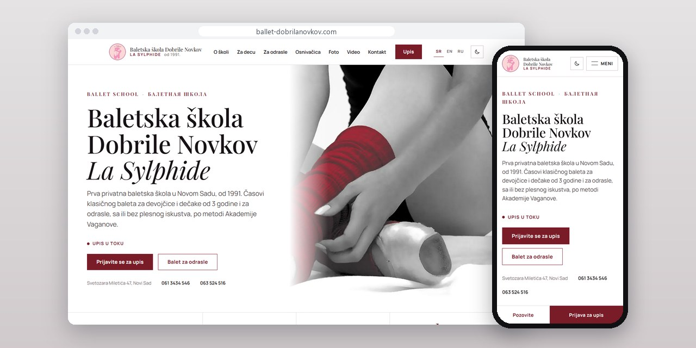
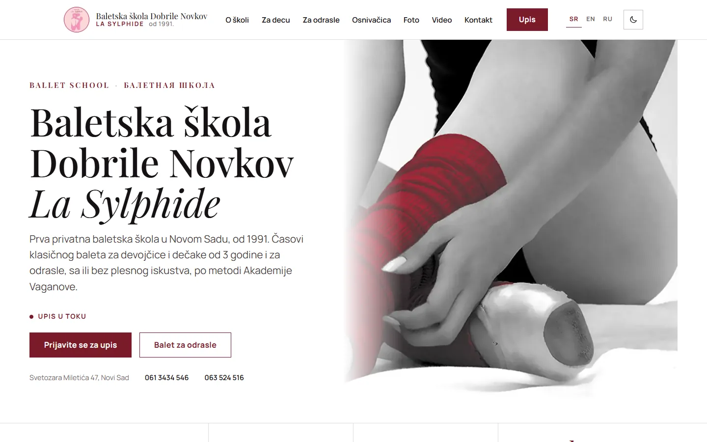
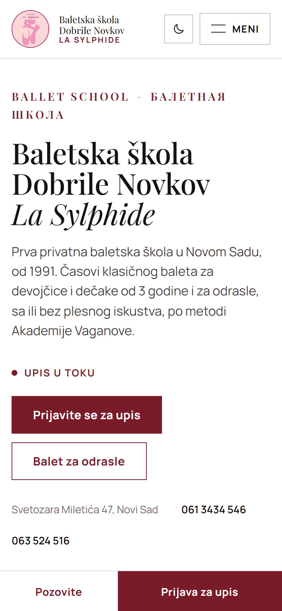
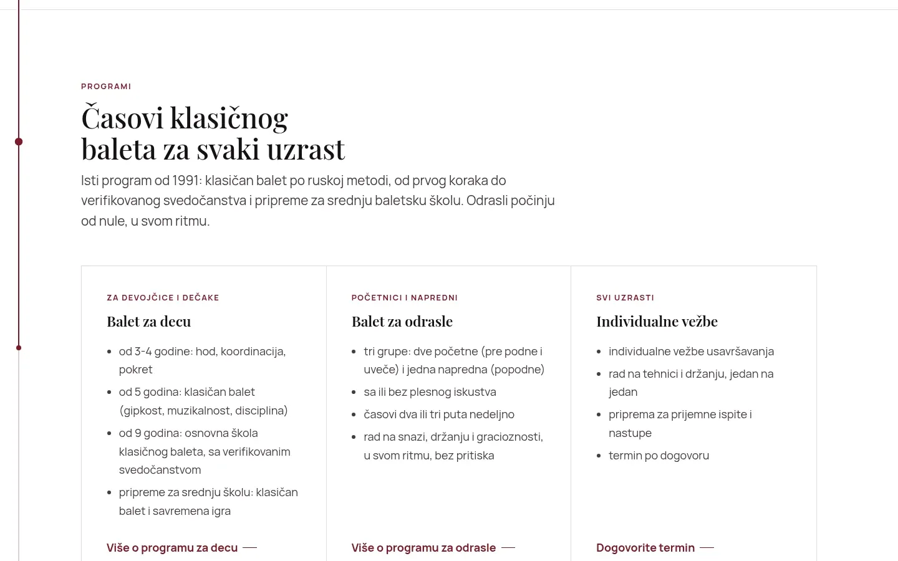
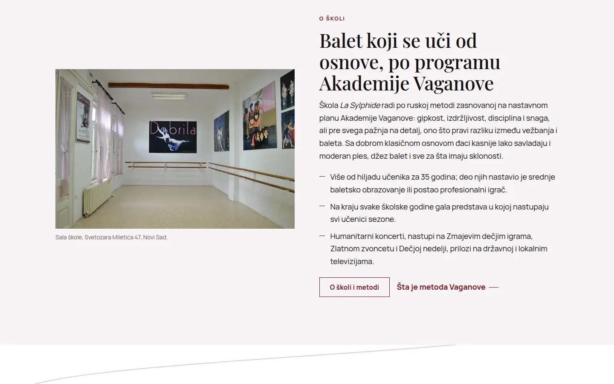

# La Sylphide

Site for a Novi Sad ballet school founded in 1991, in Serbian, English and Russian, rewritten in plain PHP from a 2016 WordPress site.

**[ballet-dobrilanovkov.com](https://www.ballet-dobrilanovkov.com/)** · [Case study (in Serbian)](https://svilenkovic.com/radovi/la-sylphide) · [Srpski](README.sr.md)

> [!NOTE]
> Client project. The source code belongs to the client and stays in a private repository. This page describes what I built and how.

<table>
  <tr><td><b>Client</b></td><td>Dobrila Novkov Ballet School La Sylphide</td></tr>
  <tr><td><b>Industry</b></td><td>Classical ballet for children and adults, Vaganova method</td></tr>
  <tr><td><b>Location</b></td><td>Novi Sad, Serbia</td></tr>
  <tr><td><b>Type</b></td><td>Multi-page website in three languages</td></tr>
  <tr><td><b>My role</b></td><td>Redesign, development, migration, SEO and maintenance</td></tr>
  <tr><td><b>Stack</b></td><td>PHP, no CMS, hreflang sr/en/ru, WebP, View Transitions</td></tr>
</table>

## About the project

La Sylphide has taught classical ballet in Novi Sad since 1991, following the Vaganova Academy curriculum, with groups for children from age three and three groups for adults. The old site was WordPress 4.6 from 2016 on an abandoned theme: seven pages, four of five embedded videos long gone from YouTube, and not one page about the adult classes.

We first agreed on a refresh, but after going through the code I proposed a rewrite and the school accepted. The new site is plain PHP pages with shared includes, no database and no admin, because the content changes once or twice a year. The enrolment form works without JavaScript: the CSRF token is rendered on the server, the form posts normally and the page returns with a message, so it goes through on an old phone or a weak connection.

## What I built

- Serbian pages plus English and Russian landing pages, linked with hreflang for sr-Latn, en and ru and an x-default pointing to Serbian
- Self-hosted fonts split into Latin, Latin Extended and Cyrillic subsets, so the Russian page has its letters and the Serbian one doesn't download them
- Videos and the map load only when a visitor asks for them, YouTube from its no-cookie domain; page changes use View Transitions with prefetch on hover
- Code that runs on both PHP 7.4 and 8.3, with one config that detects the host and sets the base URL, the form recipient and whether pages may be indexed
- Migration with a full backup first, the old WordPress kept out of reach as a fallback, old image URLs preserved, single-hop redirects and a 410 for leftover WordPress URLs
- A light and dark theme applied before first paint, with two separate burgundy values in dark mode so text keeps its contrast

## Results

| | Performance | Accessibility | Best practices | SEO |
| :-- | :-: | :-: | :-: | :-: |
| Mobile | 97 | 100 | 100 | 100 |
| Desktop | 100 | 100 | 100 | 100 |

PageSpeed Insights, lab test of the live site, September 2026. Security headers: 6 of 6. axe accessibility check: no violations. Structured data: `EducationalOrganization`, `LocalBusiness`.

## Screenshots

<table>
  <tr>
    <td width="68%" valign="top"></td>
    <td width="32%" valign="top"></td>
  </tr>
</table>

Classical ballet classes for every age, split by program

The school's studio and a section on the Vaganova Academy program

---

Built by [D. Svilenković](https://svilenkovic.com).
